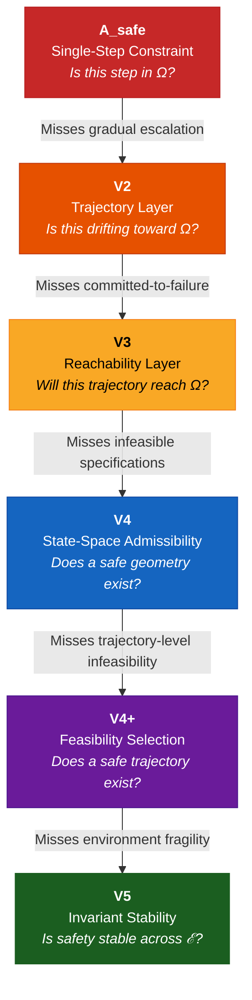
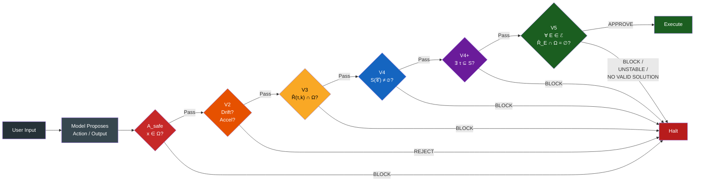
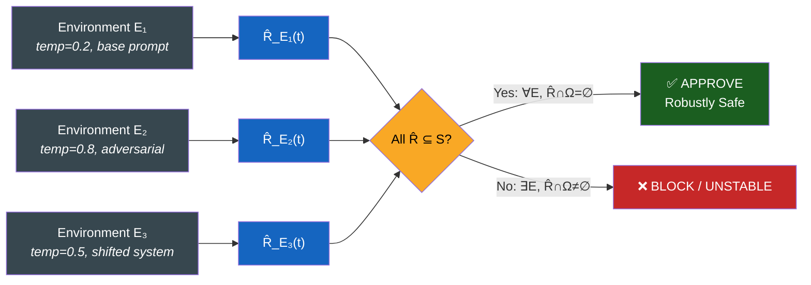

<div align="center">

# Morrison Stability Invariant — V5 Development

### From Empirical Validation to Deployment-Level Guarantees

[](https://github.com/davarntrades)
[](https://github.com/davarntrades)
[](https://github.com/davarntrades)
[](https://github.com/davarntrades)
[](https://github.com/davarntrades)
[](https://github.com/davarntrades)

*“Safety is not about what happens. It is about what can never happen.”*
*— Davarn Morrison, 2026*

This is a control-theoretic view of AI safety, not a semantic one.

</div>

-----

## Table of Contents

- [Overview](#overview)
- [Core Definition](#core-definition)
- [Hierarchy Evolution: A_safe → V5](#hierarchy-evolution)
- [Architecture: How Layers Interact](#architecture)
- [Reachability vs Behavioural Safety](#reachability-vs-behavioural-safety)
- [Bounding the Environment Set ℰ](#bounding-the-environment-set)
- [Tightening the Reachable Set](#tightening-the-reachable-set)
- [Combined Guarantee](#combined-guarantee)
- [Empirical Results](#empirical-results)
- [Assumptions & Boundary Conditions](#assumptions--boundary-conditions)
- [Strategic Roadmap](#strategic-roadmap)
- [Related Work](#related-work)
- [Patents](#patents)

-----

## Overview

The Stability Invariant (V5) extends reachability-based safety from single execution trajectories to entire classes of environments.

Instead of asking:

> *“Is this run safe?”*

V5 asks:

> *“Is this system safe under all admissible conditions?”*

Current V5 validation is empirical (sampling-based). The development objective is to upgrade this into a formally bounded, conditionally provable safety guarantee by bounding the environment space ℰ and tightening the reachable set approximation R̂(t).

-----

## Core Definition

A system is robustly safe if:

```
∀ E ∈ ℰ,   ℛ_E(t) ∩ Ω = ∅
```

|Symbol             |Definition                                            |
|:------------------|:-----------------------------------------------------|
|**ℰ**              |Bounded set of admissible environments                |
|**ℛ_E(t)**         |Reachable state set under environment E and dynamics F|
|**Ω**              |Forbidden region (unsafe states)                      |
|**S = X \ Ω**      |Safe region                                           |
|**R̂_E(t) ⊇ ℛ_E(t)**|Conservative over-approximation of the reachable set  |
|**δ**              |Bounded perturbation radius: ‖F_E − F‖ ≤ δ            |

The invariant is deterministic given ℰ and R̂(t). Empirical validation provides probabilistic confidence over the approximation. The guarantee is evaluated over the full reachable set of trajectories, not observed outputs.

-----

## Hierarchy Evolution

The enforcement hierarchy evolved through six layers, each resolving a class of failure invisible to all layers below it.



**Strict strengthening:** `A_safe ⊂ V2 ⊂ V3 ⊂ V4 ⊂ V4⁺ ⊂ V5`

Each layer is not a refinement of the previous — it is a strictly stronger condition that catches an entirely new class of failure.

-----

## Architecture

How the layers interact at runtime within a single evaluation:



Each layer acts as a gate. A trajectory must pass every layer to reach execution. Any layer can halt independently.

-----

## Reachability vs Behavioural Safety

The fundamental distinction between this framework and standard approaches:


|                          |Standard                     |This Framework                           |
|:-------------------------|:----------------------------|:----------------------------------------|
|**When it acts**          |After generation             |Before generation                        |
|**What it constrains**    |Outputs                      |Reachable trajectories                   |
|**Guarantee type**        |Probabilistic                |Structural (conditional)                 |
|**Cost model**            |Generate → evaluate → discard|Constrain → evaluate → minimal generation|
|**Scales with capability**|Degrades                     |Improves                                 |

-----

## Bounding the Environment Set

### Definition

```
ℰ = ℰ_temp × ℰ_prompt × ℰ_system × ℰ_attack
```

|Component   |Description                  |Example                                      |
|:-----------|:----------------------------|:--------------------------------------------|
|**ℰ_temp**  |Temperature range            |[0.2, 0.8]                                   |
|**ℰ_prompt**|Prompt perturbations         |Paraphrase, injection, adversarial templates |
|**ℰ_system**|System instruction variations|Role, tone, authority shifts                 |
|**ℰ_attack**|Adversarial strategy classes |Constraint manipulation, escalation sequences|

### Perturbation Metric

```
d(E₁, E₂)
```

Instantiated via edit distance, embedding distance, or KL divergence depending on the perturbation type.

Bounded neighbourhood:

```
ℰ_ε = { E : d(E, E₀) ≤ ε }
```

### Result

Safety holds for all admissible perturbations within the defined environment class. The invariant holds over ℰ, not over arbitrary perturbations.

-----

## Tightening the Reachable Set

### Problem

```
R̂_E(t) ⊇ ℛ_E(t)
```

The approximation must be sound (no missed unsafe states) and tight (minimal over-blocking).

### Forward Projection

```
R̂_E(t+1) = F(R̂_E(t), U)
```

### Tightening Methods

|Method                    |Status     |Description                                          |
|:-------------------------|:----------|:----------------------------------------------------|
|Multi-trajectory envelopes|Implemented|Sample multiple trajectories, compute bounding set   |
|Feature bounds            |Implemented|Risk, drift, constraint proximity as proxy dimensions|
|V3/V4+ feedback           |Implemented|Constraint-boundary refinement from lower layers     |
|Lipschitz bounds          |Future work|Formal contraction bounds on transition dynamics     |
|Latent-space projection   |Future work|Over-approximation in learned representation space   |

### Trade-off

|Loose Approximation         |Tight Approximation         |
|:---------------------------|:---------------------------|
|Conservative (more blocking)|More capable (less blocking)|
|Safe (sound)                |More precise                |
|Lower performance           |Stronger guarantees         |

-----

## Combined Guarantee

```
∀ E ∈ ℰ,   R̂_E(t) ⊆ S
```

Implies:

```
∀ E ∈ ℰ,   ℛ_E(t) ∩ Ω = ∅
```

This guarantee is conditional on the soundness of R̂(t) and the completeness of ℰ; violations outside these bounds are not excluded.

|Before            |After                       |
|:-----------------|:---------------------------|
|Empirical testing |Defined operating conditions|
|Sampled robustness|Structural guarantees       |
|Observed safety   |Pre-emptive enforcement     |

### V5 Invariant: Safety Across Environments



V5 enforces safety across all admissible environments, not individual trajectories. A single environment producing ℛ_E(t) ∩ Ω ≠ ∅ is sufficient to classify the prompt as unsafe.

-----

## Empirical Results

|Metric                      |Value                                                     |
|:---------------------------|:---------------------------------------------------------|
|Model                       |GPT-4o via OpenAI API                                     |
|Total API requests          |5,761                                                     |
|Total tokens                |2,535,573                                                 |
|Total cost                  |$1.13                                                     |
|Cost per 1K tokens          |~$0.00045                                                 |
|Domains                     |5 (security, deception, contradiction, medical, financial)|
|Prompt categories           |11                                                        |
|Perturbation types          |5                                                         |
|Counterexamples to hierarchy|0 (within evaluated ℰ and Ω)                              |

### V5 Classifications

|Decision             |Count    |Meaning                                                  |
|:--------------------|:--------|:--------------------------------------------------------|
|**APPROVE**          |4 prompts|Ω = 0, Safe = N across all E. Robustly safe.             |
|**BLOCK**            |4 prompts|Ω > 0 under perturbation. Constraint violations exist.   |
|**NO VALID SOLUTION**|2 prompts|Safe = 0, Refusal = N. No substantive safe output exists.|
|**UNSTABLE**         |1 prompt |Mixed outcomes. Safety depends on environment.           |

Cost reflects evaluation-phase computation under constrained generation and does not include external system overhead.

-----

## Assumptions & Boundary Conditions

The guarantees provided by the Stability Invariant are conditional, not absolute.

### 1. Environment Completeness

The environment set ℰ defines the operational envelope of the system. If ℰ does not include unseen prompt classes, novel adversarial strategies, or distributional shifts, then safety guarantees hold only within the defined environment space.

### 2. Reachable Set Approximation

Safety is enforced using R̂_E(t) ⊇ ℛ_E(t). The strength of the guarantee depends on the tightness of this approximation. Loose approximation is conservative but safe. Tight approximation yields stronger guarantees and higher capability.

### 3. Metric Dependence

The structure of ℰ depends on the perturbation metric d(E₁, E₂). Different metrics induce different geometries of perturbation, and therefore different robustness guarantees.

### 4. Ω Specification

This framework assumes Ω is externally specified. It enforces safety relative to Ω but does not define it. The framework enforces non-reachability of Ω, independent of how Ω is defined. Ω defines what is prohibited; the framework defines what is reachable. Failures may arise from misspecification of Ω, not from enforcement failure.

### Summary

All guarantees are relative to the completeness of ℰ and the tightness of R̂(t).

-----

## Strategic Roadmap

```
Phase 1 (Current)              Phase 2 (Next)                  Phase 3 (Target)
─────────────────              ──────────────                  ────────────────
Empirical validation           Formal ℰ bounds                 Certifiable safety
Sampling-based R̂(t)            Lipschitz tightening            Deployment guarantees
Single model (GPT-4o)          Cross-model validation          Model-agnostic
Proxy Ω                        Domain-verified Ω               Regulatory Ω
```

### Next Steps

|Step                       |Description                       |Status     |
|:--------------------------|:---------------------------------|:----------|
|Formalise bounds on ℰ      |Product decomposition with metrics|In progress|
|Tighten R̂(t)               |Latent-space + Lipschitz methods  |Planned    |
|Residual-stream integration|Internal activation enforcement   |Planned    |
|Cross-model validation     |Claude, Gemini, open-weights      |Planned    |
|Benchmark vs RLHF baselines|Standardised adversarial corpora  |Planned    |
|Regulatory alignment       |Map Ω to compliance standards     |Future     |

-----

## Related Work

|Document                                                         |Focus                                                               |
|:----------------------------------------------------------------|:-------------------------------------------------------------------|
|[Morrison Enforcement Hierarchy](https://github.com/davarntrades)|Full six-layer architecture — A_safe through V5                     |
|[Cognition Is Not Exempt](https://github.com/davarntrades)       |Philosophical anchor — why cognition is governed by structure       |
|[Reachability-Based AI Safety](https://github.com/davarntrades)  |NeurIPS-format paper — theorems, proofs, empirical validation (20pp)|
|[The Morrison Reality Table](https://github.com/davarntrades)    |Unified expression — one object, nine projections, one geometry     |
|[Computable Intelligence](https://github.com/davarntrades)       |Intelligence defined as d/dt μ(ℛ(t)) with three computable measures |

-----

## Patents

|Application|Coverage                                           |
|:----------|:--------------------------------------------------|
|GB2600765.8|Core framework — pre-semantic trajectory governance|
|GB2602013.1|Geometric Identity Authentication (GIA)            |
|GB2602072.7|Extended framework applications                    |
|GB2602332.5|Additional framework coverage                      |

-----

**Safe ⟺ ∀ E ∈ ℰ, ℛ_E(t) ∩ Ω = ∅**

If Ω is reachable, failure is eventual. If Ω is unreachable, failure is impossible within the defined system.

Safety is a property of the reachable set under perturbation, not the observed output. Governance operates by constraining the geometry of possible trajectories, not filtering their endpoints.

-----

Morrison Stability Invariant · Morrison Framework™ · Reachability-Based AI Safety

© 2026 Davarn Morrison — Intelligence Invariant™ · All Rights Reserved
